# Lab 05 – Azure Bastion


---

# 📖 Overview

This lab demonstrates how to deploy **Azure Bastion**, a fully managed Platform-as-a-Service (PaaS) solution that provides secure browser-based Remote Desktop (RDP) and SSH connectivity to Azure Virtual Machines without exposing port **3389** or **22** to the public Internet.

Instead of connecting directly through a Public IP, Azure Bastion establishes secure connectivity over **HTTPS (TCP 443)** through the Azure Portal.

---

# 🎯 Objectives

- Deploy Azure Bastion
- Configure AzureBastionSubnet
- Create Bastion Public IP
- Secure Remote Desktop Access
- Connect to Azure VM through Browser
- Eliminate Direct Public RDP Access
- Improve Azure Network Security

---

# 🛠 Azure Services Used

- Azure Bastion
- Azure Virtual Machine
- Azure Virtual Network
- AzureBastionSubnet
- Public IP Address
- Network Security Group (NSG)

---

# 🌐 Lab Configuration

| Resource | Value |
|-----------|-------|
| Resource Group | RG-HybridLab |
| Bastion Name | bastion-hq |
| Region | Central India |
| Tier | Standard |
| Instance Count | 2 |
| Virtual Network | vnet-hq-001 |
| Bastion Subnet | AzureBastionSubnet (/26) |
| Virtual Machine | Server01 |
| Connection Type | Browser-based RDP |

---

# 🏗 Architecture

```text
                 Internet
                     │
              HTTPS (TCP 443)
                     │
              Azure Portal
                     │
             Azure Bastion
                     │
        AzureBastionSubnet (/26)
                     │
              vnet-hq-001
                     │
                Server01 VM
```

---

# 📸 Step 1 – Azure Portal Dashboard

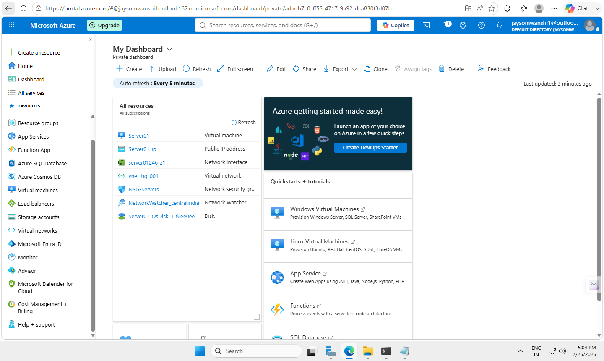

---

# 📸 Step 2 – Search Azure Bastion

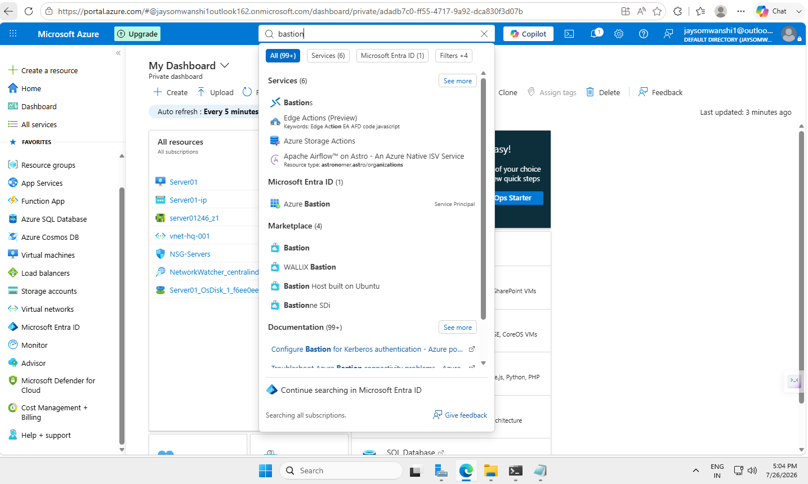

---

# 📸 Step 3 – Open Azure Bastion Service

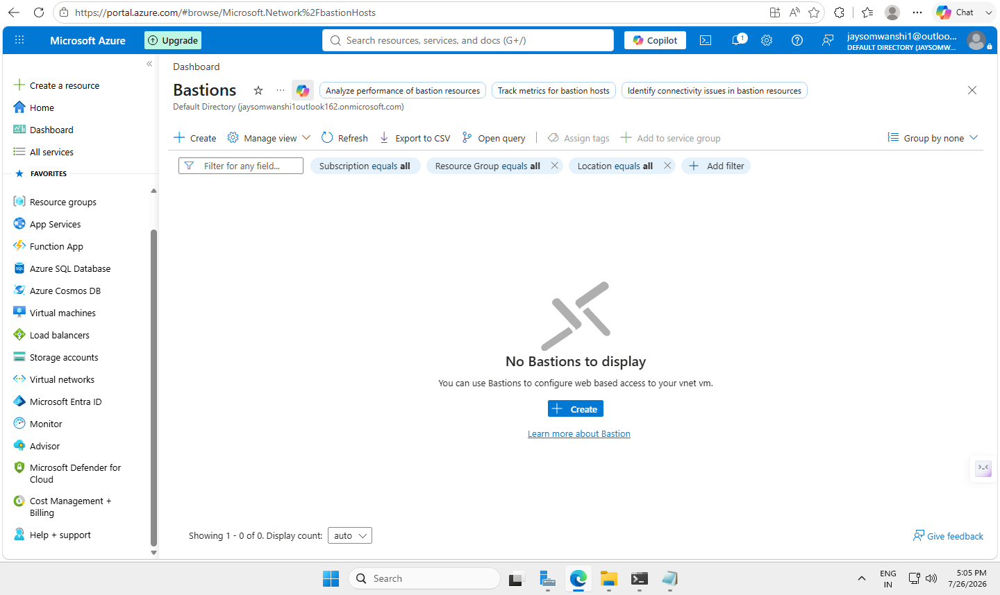

---

# 📸 Step 4 – Create Azure Bastion

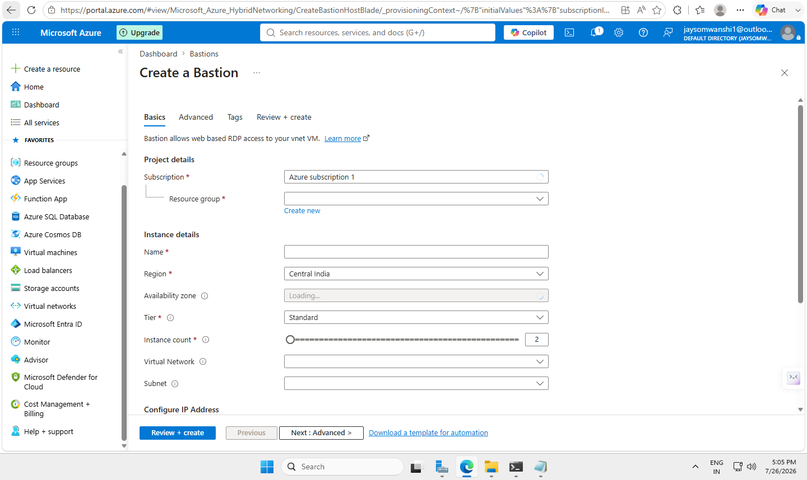

---

# 📸 Step 5 – Configure Basic Settings

- Resource Group
- Bastion Name
- Region
- Tier

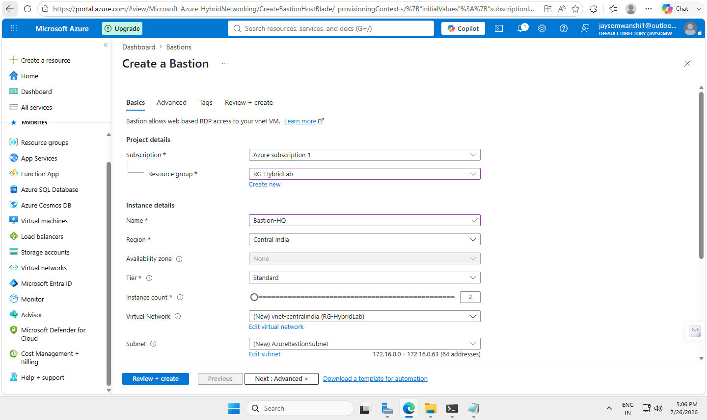

---

# 📸 Step 6 – Configure Networking

- Virtual Network
- AzureBastionSubnet
- Public IP Address

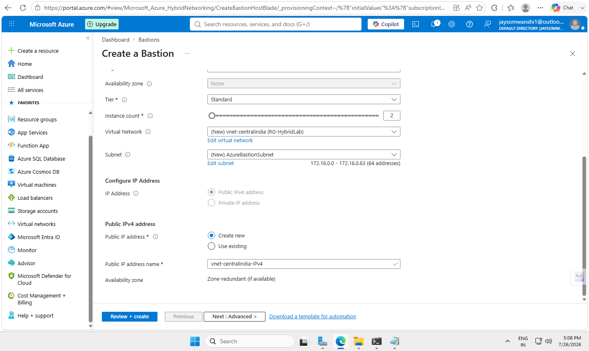

---

# 📸 Step 7 – Validation Passed

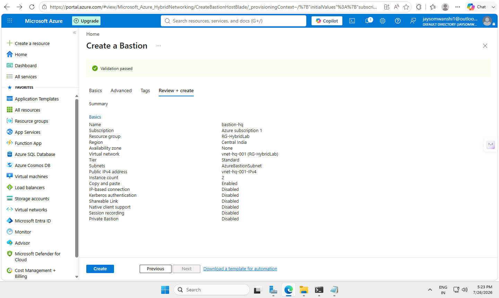

---

# 📸 Step 8 – Deployment in Progress

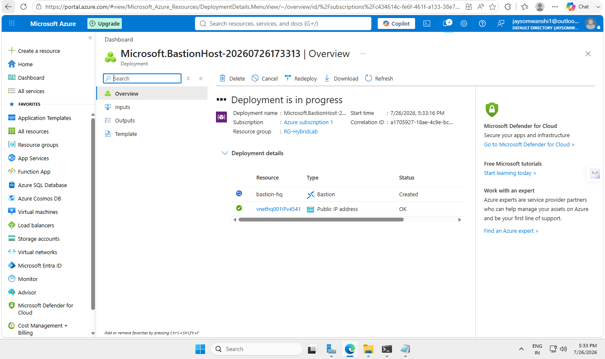

---

# 📸 Step 9 – Deployment Completed Successfully

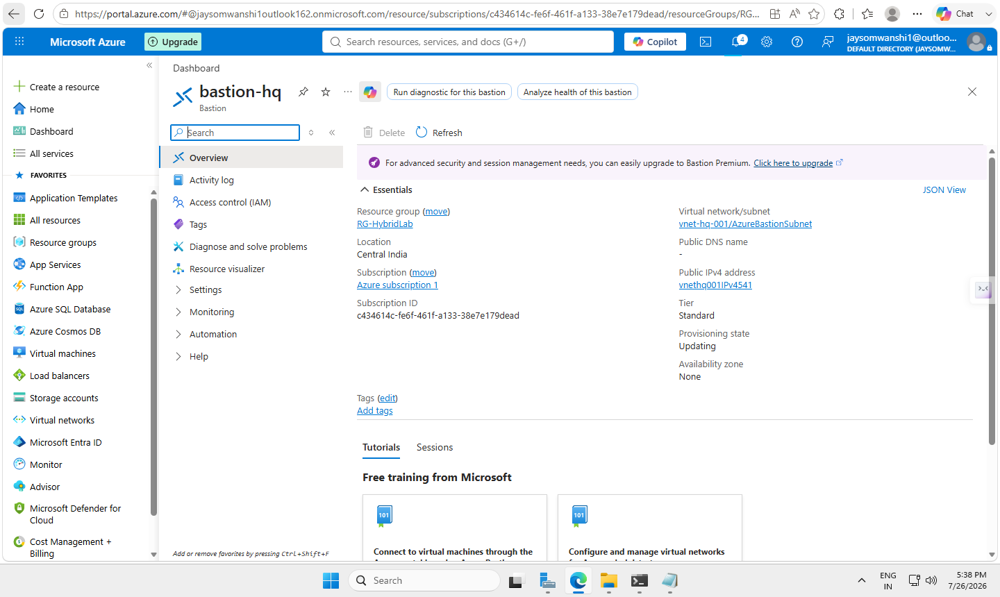

---

# 📸 Step 10 – AzureBastionSubnet Created

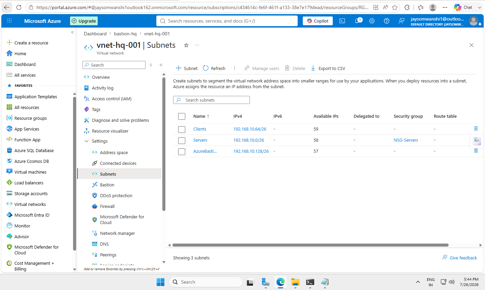

---

# 📸 Step 11 – Connect to Server01

The Azure Bastion connection page is used to enter the VM credentials and establish a secure browser-based Remote Desktop session.

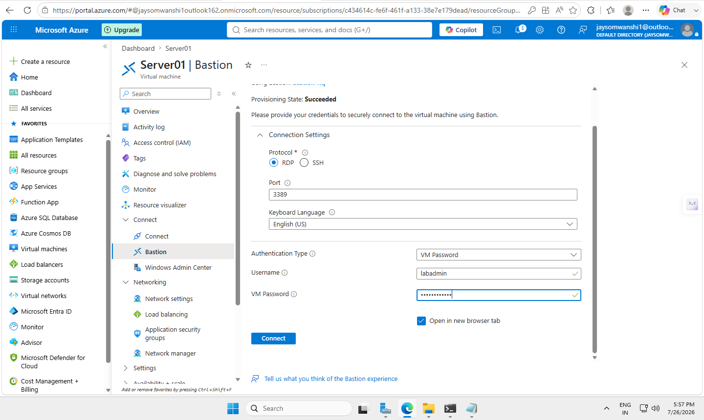

---

# 📸 Step 12 – Browser-based Remote Desktop

Azure Bastion successfully connects to the Windows Server virtual machine directly within the Azure Portal without exposing RDP over the Internet.

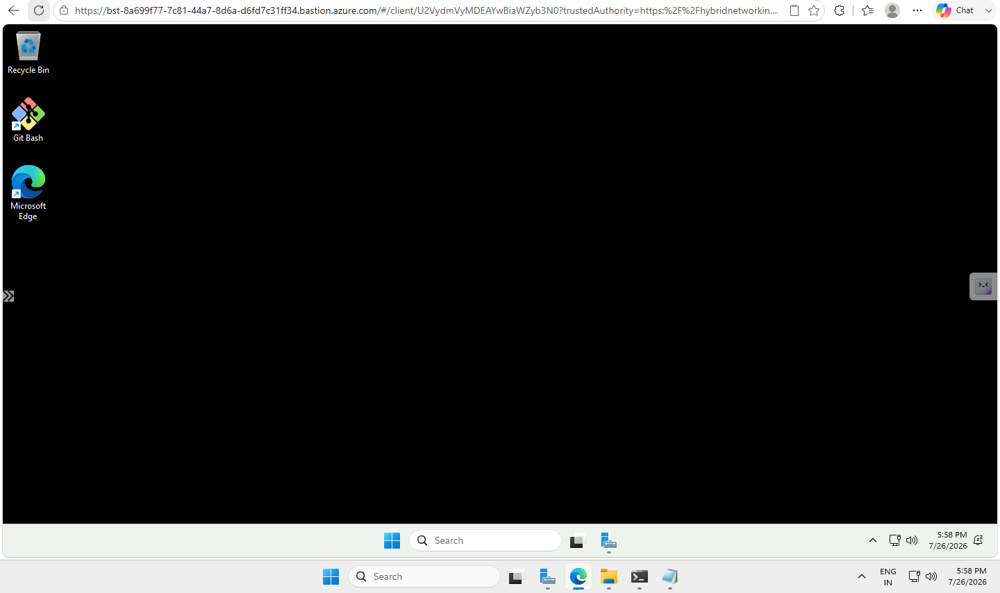

---

# 📸 Step 13 – Successful Azure Bastion Session

A successful browser-based RDP session to **Server01** through Azure Bastion confirms secure remote administration without requiring a Public RDP endpoint.

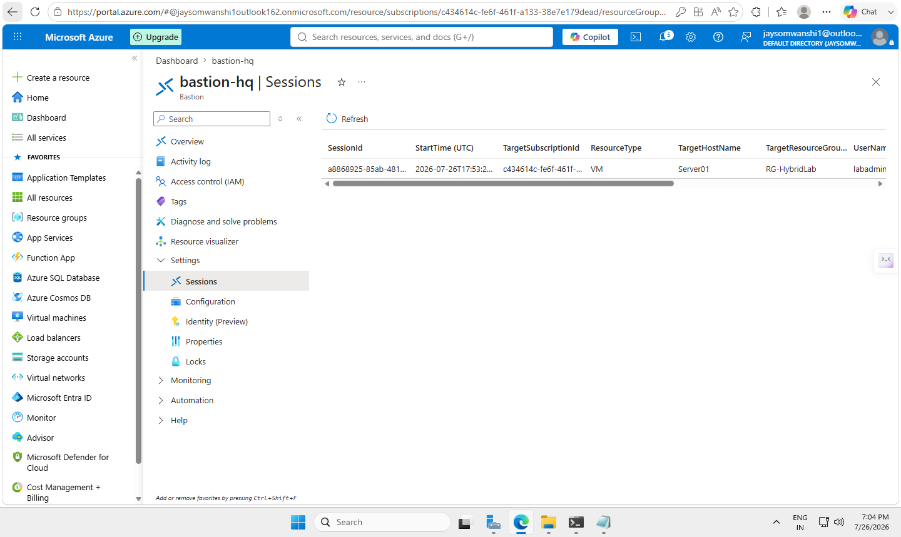

---

# 🔒 Security Benefits

- Browser-based Remote Desktop
- No Public RDP Port (3389)
- Secure HTTPS (443) Connectivity
- Managed Microsoft PaaS Service
- Reduces Attack Surface
- Protects Azure Virtual Machines
- Simplifies Secure Remote Administration

---

# 📚 Skills Demonstrated

- Azure Bastion Deployment
- Azure Virtual Networking
- AzureBastionSubnet Configuration
- Secure Remote Administration
- Windows Server Remote Management
- Azure Infrastructure Security
- Network Security Best Practices

---

# ✅ Lab Outcome

Successfully deployed Azure Bastion and securely connected to the **Server01** Azure Virtual Machine using browser-based Remote Desktop without exposing RDP directly to the Internet.

---

# 🚀 Next Lab

**Lab 06 – Active Directory Domain Services (AD DS)**

Topics include:

- Active Directory Domain Services
- DNS Configuration
- Domain Controller
- Organizational Units (OU)
- Users & Groups
- Group Policy Objects (GPO)

---

# 👨‍💻 Author

**Pavan Baburao Somwanshi**

**System Administrator | Azure | Windows Server | Microsoft 365 | Networking | Cloud Computing**

GitHub: https://github.com/jaysomwanshi

---

⭐ If you found this project helpful, consider giving the repository a **Star**.
