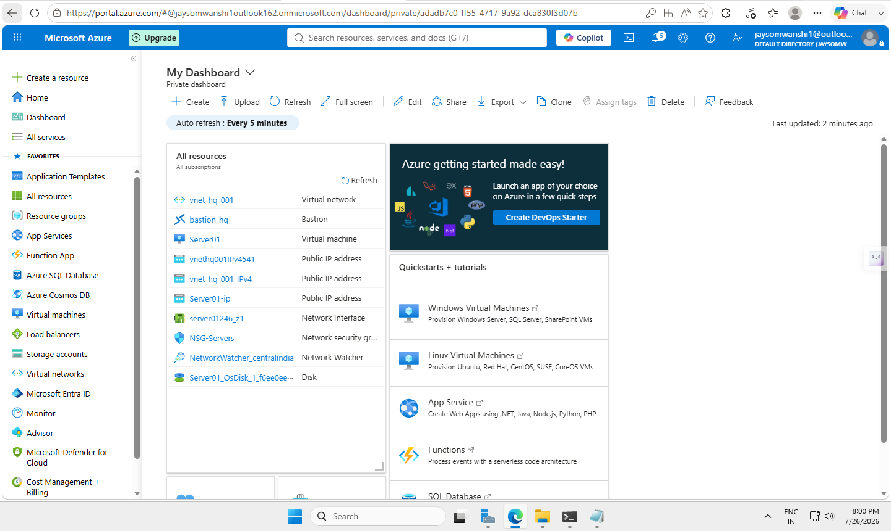
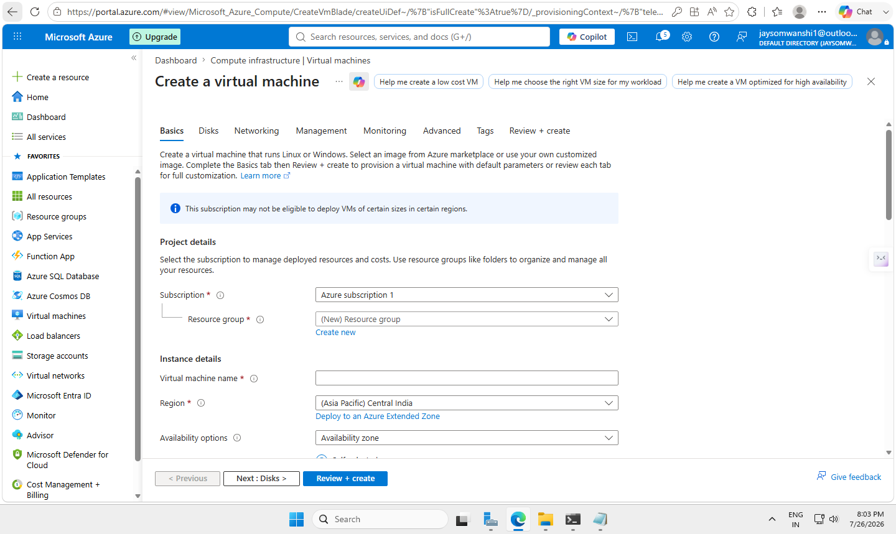
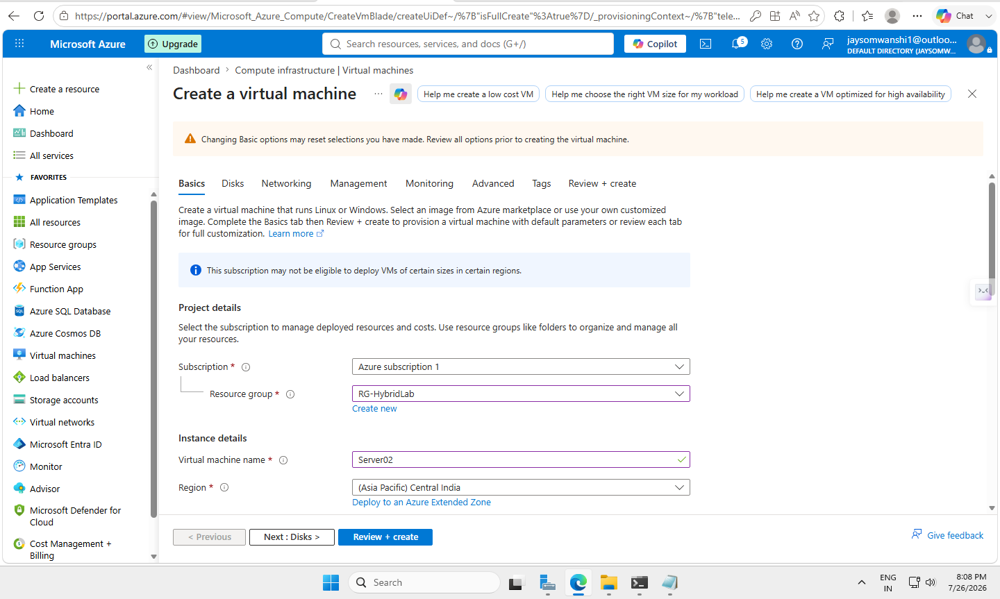
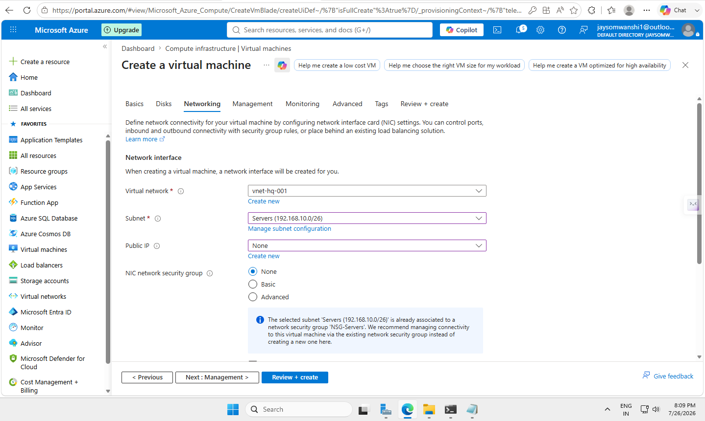
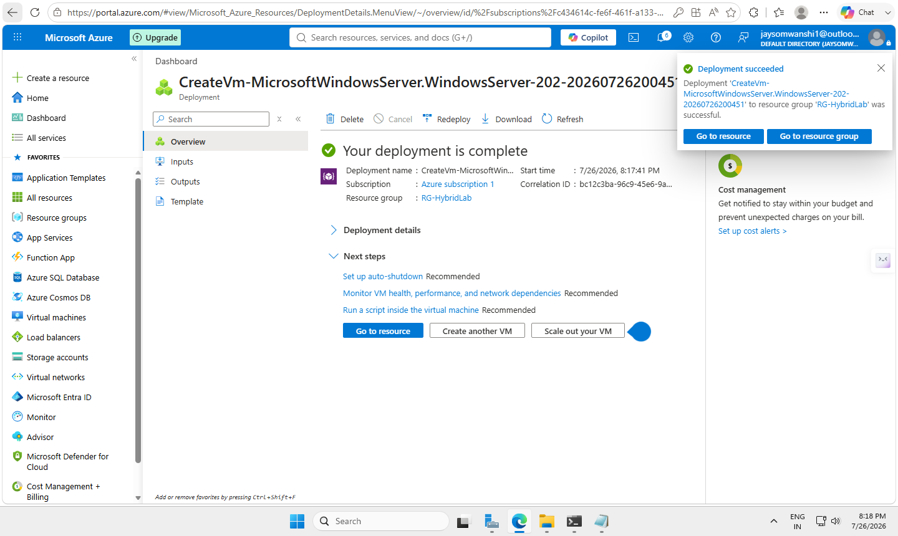
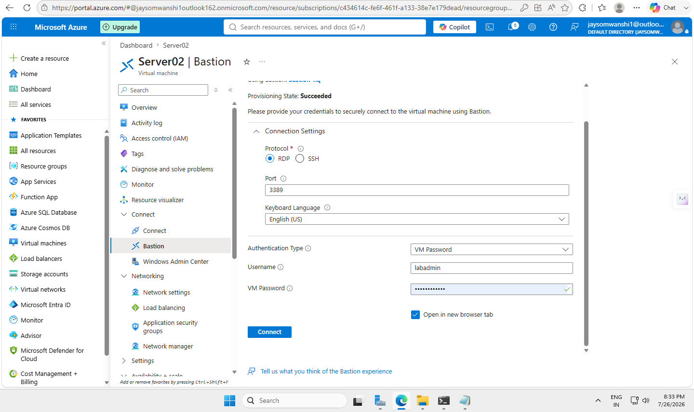

# Lab 06 – Deploy Windows Server Virtual Machine in Azure


---

# 📖 Overview

This lab demonstrates how to deploy a **Windows Server Virtual Machine** inside Microsoft Azure using an existing Virtual Network and secure it using Azure networking components.

The VM was deployed inside the **Servers subnet** with a private IP address and without a Public IP. Secure administration was performed using **Azure Bastion**, allowing browser-based Remote Desktop access without exposing RDP directly to the Internet.

---

# 🎯 Objectives

- Deploy Windows Server Virtual Machine
- Configure VM networking
- Connect VM to existing Virtual Network
- Assign VM to Servers subnet
- Configure private IP addressing
- Apply Network Security Group rules
- Deploy VM without Public IP exposure
- Access VM securely using Azure Bastion

---

# 🛠 Azure Services Used

- Azure Virtual Machine
- Windows Server 2022 Datacenter
- Azure Virtual Network
- Azure Subnet
- Network Security Group (NSG)
- Network Interface Card (NIC)
- Azure Bastion

---

# 🌐 Lab Configuration

| Resource | Value |
|-----------|-------|
| Resource Group | RG-HybridLab |
| Virtual Machine Name | Server02 |
| Operating System | Windows Server 2022 Datacenter |
| Region | Central India |
| Virtual Network | vnet-hq-001 |
| Address Space | 192.168.10.0/24 |
| Subnet | Servers |
| Subnet Range | 192.168.10.0/26 |
| Private IP Address | 192.168.10.5 |
| Public IP Address | None |
| Network Security Group | NSG-Servers |
| Access Method | Azure Bastion Browser RDP |

---

# 🏗 Architecture

```text
                 Azure Subscription
                         │
                         │
                  RG-HybridLab
                         │
                         │
                  vnet-hq-001
                192.168.10.0/24
                         │
                         │
              Servers Subnet (/26)
               192.168.10.0/26
                         │
                         │
                  NSG-Servers
                         │
                         │
                  Server02 VM
                Private IP:
                192.168.10.5
                         │
                         │
                Azure Bastion
                         │
                         │
              Browser-based RDP Access
```

---

# 📸 Step 1 – Azure Portal Dashboard



---

# 📸 Step 2 – Open Virtual Machine Creation


---

# 📸 Step 3 – Start Virtual Machine Deployment



---

# 📸 Step 4 – Configure Basic Settings

Configured:

- Resource Group
- Virtual Machine Name
- Region
- Windows Server Image
- Administrator Account



---

# 📸 Step 5 – Configure Networking

Configured:

- Existing Virtual Network
- Servers Subnet
- No Public IP Address
- Existing Network Security Group



---

# 📸 Step 6 – Deployment Validation

Azure successfully validated the VM configuration before deployment.


---

# 📸 Step 7 – Deployment in Progress


---

# 📸 Step 8 – Deployment Completed Successfully



---

# 📸 Step 9 – Open Azure Bastion Connection

The VM was accessed securely using Azure Bastion instead of direct Public RDP.



---

# 📸 Step 10 – Successful Browser-based RDP Session

Azure Bastion successfully connected to the Windows Server VM through the Azure Portal.


---

# 🔒 Security Benefits

- No Public IP assigned to Windows Server
- No direct Internet exposure
- Secure browser-based Remote Desktop
- Controlled access through Azure Bastion
- Network Security Group protection
- Reduced attack surface
- Private Azure networking

---

# 📚 Skills Demonstrated

- Azure Virtual Machine Deployment
- Windows Server Deployment
- Azure Virtual Networking
- Subnet Assignment
- Private IP Address Management
- Network Security Group Configuration
- Azure Bastion Administration
- Secure Cloud Infrastructure Design

---

# ✅ Lab Outcome

Successfully deployed a Windows Server Virtual Machine inside Azure using an existing Virtual Network and Servers subnet.

The VM was configured with a private IP address and securely accessed through Azure Bastion without exposing RDP directly to the Internet.

---

# 🚀 Next Lab

**Lab 07 – Active Directory Domain Services (AD DS)**

Topics include:

- Install Active Directory Domain Services
- Configure Domain Controller
- Configure DNS
- Create Users and Groups
- Create Organizational Units (OU)
- Configure Group Policy Objects (GPO)
- Join Client Machines to Domain

---

# 👨‍💻 Author

**Pavan Baburao Somwanshi**

**System Administrator | Azure | Windows Server | Microsoft 365 | Networking | Cloud Computing**

GitHub: https://github.com/jaysomwanshi

---

⭐ If you found this project helpful, consider giving the repository a **Star**.
