Yes. The important thing is **how you reference the screenshots**. Since your structure is:

```text
Lab 08 – Join Windows Client Virtual Machine to Active Directory Domain
│
├── README.md
└── screenshots
    ├── 01-azure-portal-dashboard.png
    ├── ...
```

your README must use:

```markdown

```

**Do not put screenshots inside Markdown tables** because GitHub often renders them poorly.

Below is a professional template that displays screenshots correctly.

````markdown
<div align="center">

# 🚀 Lab 08 – Join Windows Client Virtual Machine to Active Directory Domain

Deploy a Windows client virtual machine in Microsoft Azure and join it to an existing **Active Directory Domain Services (AD DS)** domain using Azure Bastion.


</div>

---

# 📖 Overview

This lab demonstrates how to deploy a Windows client virtual machine in Microsoft Azure and successfully join it to an existing Active Directory domain (**corp.local**) hosted on **SERVER01**.

The client machine is securely accessed through **Azure Bastion**, configured to use the Domain Controller's DNS server, authenticated using domain credentials, and verified after restart.

---

# 🎯 Objectives

- Deploy Windows client VM
- Connect using Azure Bastion
- Configure computer name
- Join Active Directory domain
- Authenticate with Domain Administrator
- Verify successful domain membership

---

# 🏗️ Architecture

```text
                    Microsoft Azure

             +-------------------------+
             |      Azure VNet         |
             |   192.168.10.0/24       |
             +-----------+-------------+
                         |
        -----------------------------------------
        |                                       |
+---------------------+               +----------------------+
|      SERVER01       |               |      CLIENT01        |
| Domain Controller   |<------------->| Windows Client VM    |
| Active Directory    |               | Joined to corp.local |
| DNS Server          |               | Azure Bastion        |
+---------------------+               +----------------------+
```

---

# 📂 Repository Structure

```text
Lab 08 – Join Windows Client Virtual Machine to Active Directory Domain
│
├── README.md
└── screenshots
    ├── 01-azure-portal-dashboard.png
    ├── 02-server01-overview.png
    ├── 03-create-client01-vm.png
    ├── 04-client01-vm-configuration.png
    ├── 05-validation-passed.png
    ├── 06-deployment-progress.png
    ├── 07-client01-overview.png
    ├── 08-client01-bastion-connection.png
    ├── 09-domain-join-settings.png
    ├── 10-computer-name-change.png
    ├── 11-domain-credentials.png
    ├── 12-domain-join-success.png
    └── 13-restart-required.png
```

---

# 📸 Screenshots

## 1️⃣ Azure Portal Dashboard

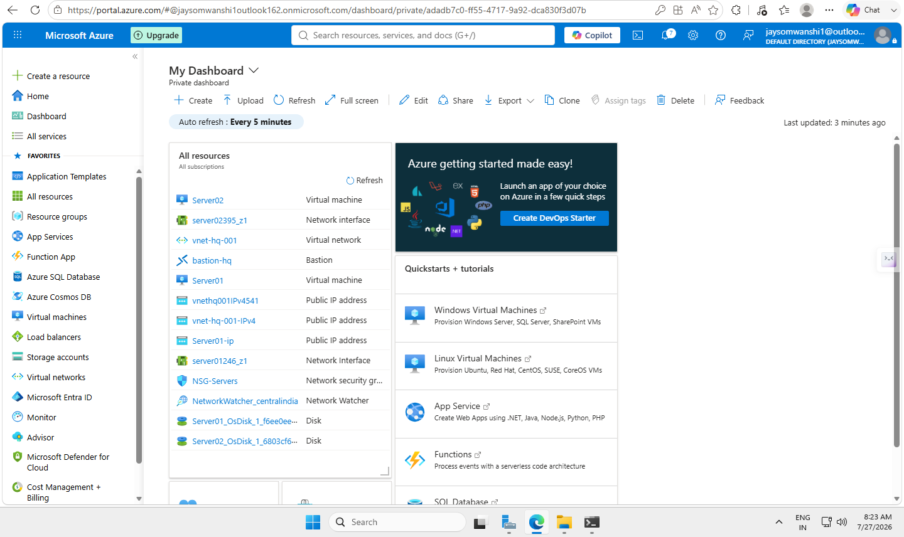

---

## 2️⃣ SERVER01 Overview

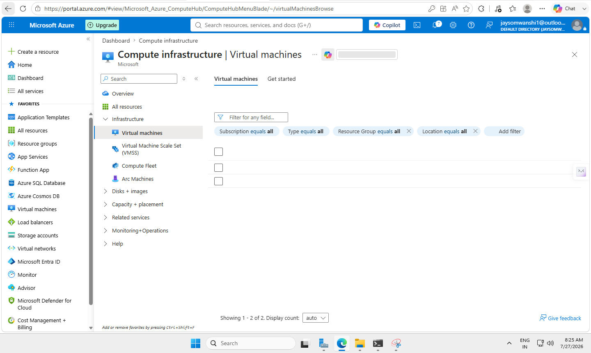

---

## 3️⃣ Create CLIENT01 Virtual Machine

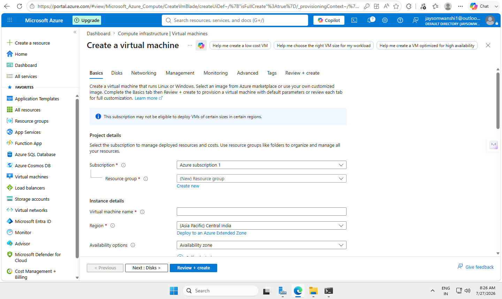

---

## 4️⃣ Virtual Machine Configuration

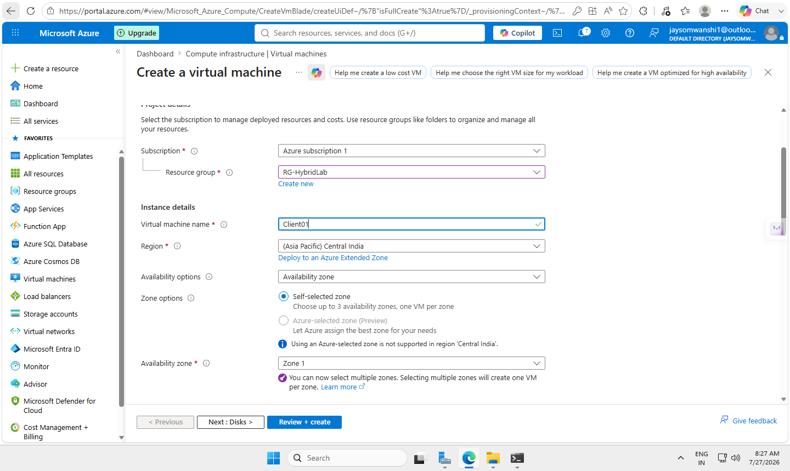

---

## 5️⃣ Validation Passed

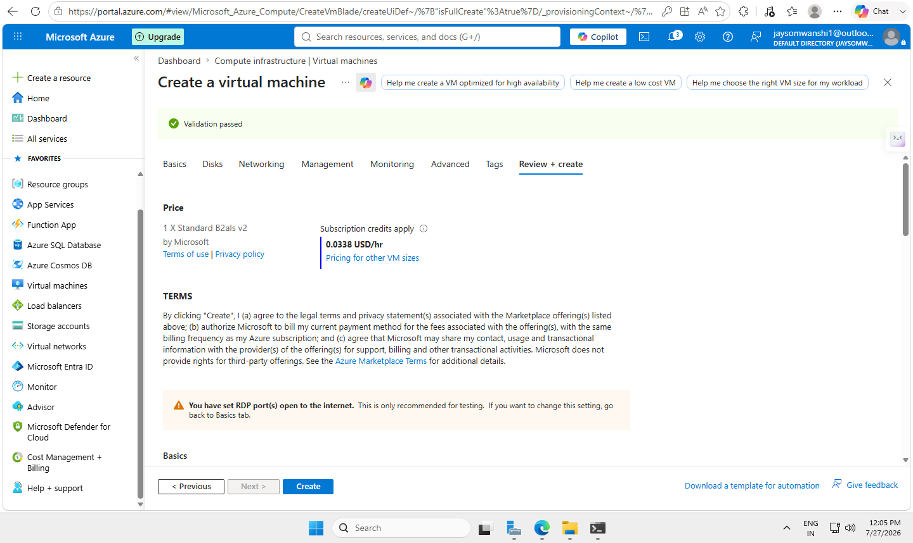

---

## 6️⃣ Deployment Progress

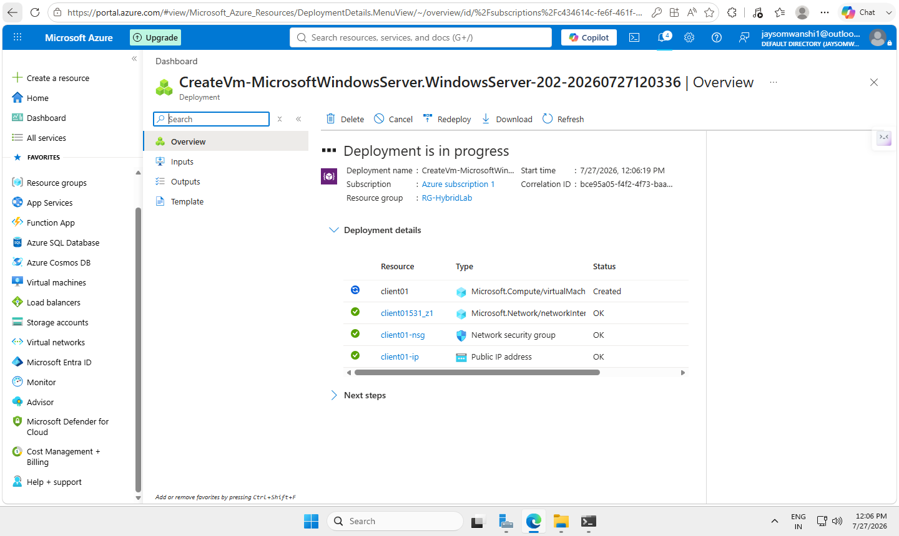

---

## 7️⃣ CLIENT01 Overview

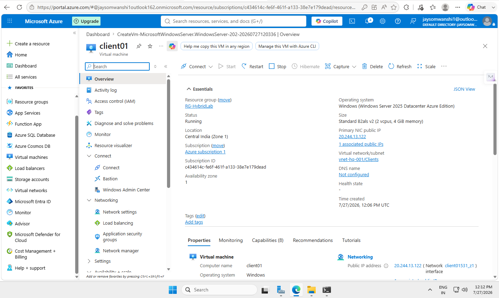

---

## 8️⃣ Azure Bastion Connection

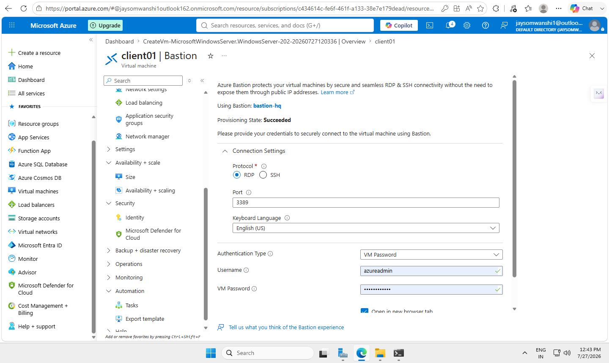

---

## 9️⃣ Domain Join Settings

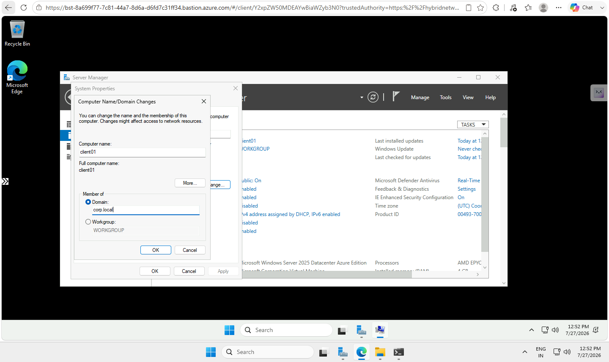

---

## 🔟 Computer Name Configuration

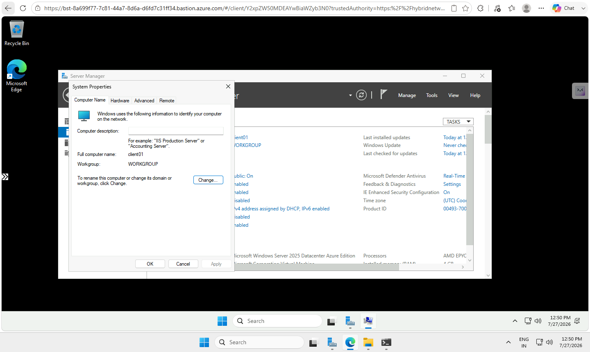

---

## 1️⃣1️⃣ Domain Credentials

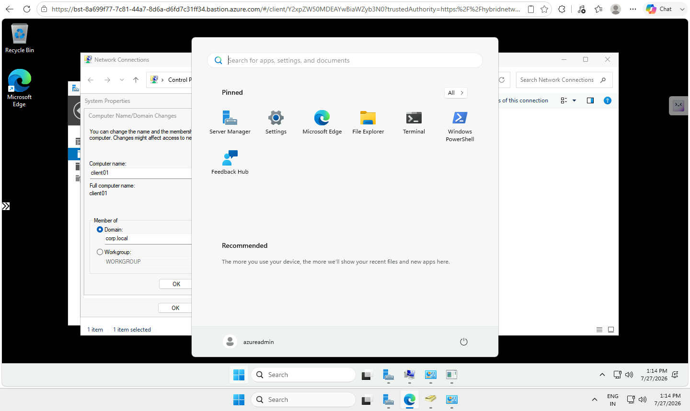

---

## 1️⃣2️⃣ Domain Join Successful

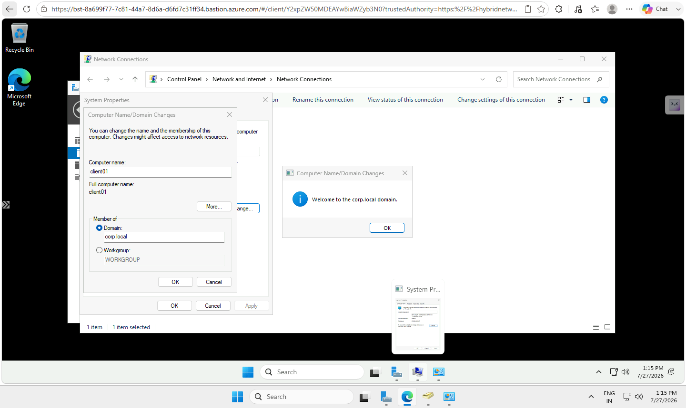

---

## 1️⃣3️⃣ Restart Required

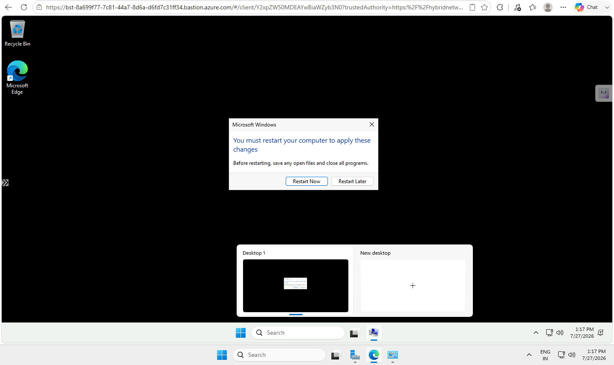

---

# ✅ Verification

Run the following commands after restarting the client:

```powershell
hostname

whoami

systeminfo | findstr /B /C:"Domain"

nltest /sc_verify:corp.local
```

---

# 🛠 Skills Demonstrated

- Microsoft Azure
- Azure Virtual Machines
- Azure Bastion
- Active Directory Domain Services
- Windows Server Administration
- Domain Join
- DNS Configuration
- Windows Networking
- PowerShell
- Enterprise Identity Management

---

# 🎓 Learning Outcomes

After completing this lab, you can:

- Deploy Azure virtual machines
- Join Windows systems to Active Directory
- Configure DNS for domain communication
- Authenticate using domain credentials
- Verify domain membership
- Troubleshoot common domain join issues

---

<div align="center">

### ⭐ If you found this lab useful, consider giving the repository a star!

</div>
````

This format renders correctly on GitHub, displays all screenshots at full width (instead of tiny table thumbnails), and presents a clean, professional portfolio.
