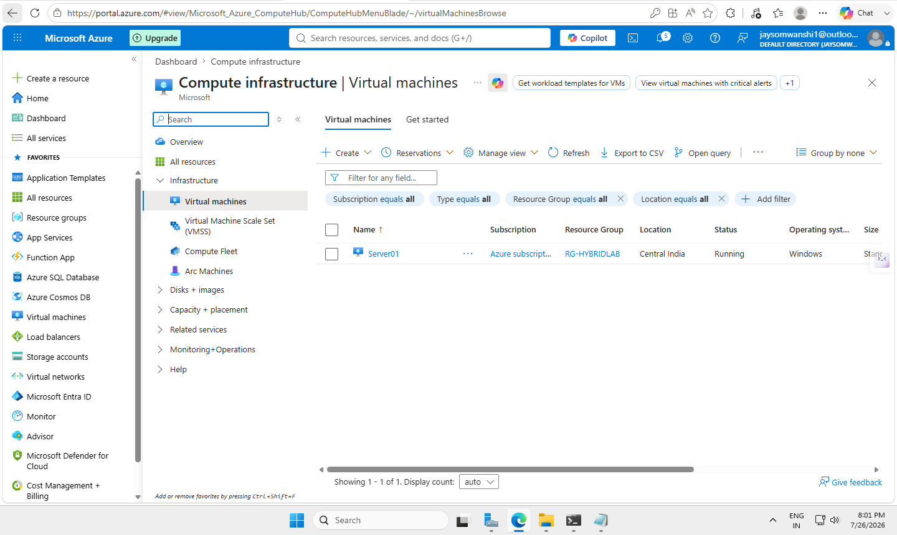
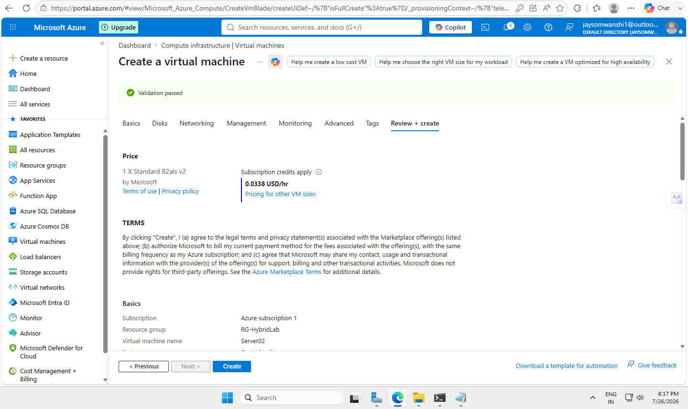
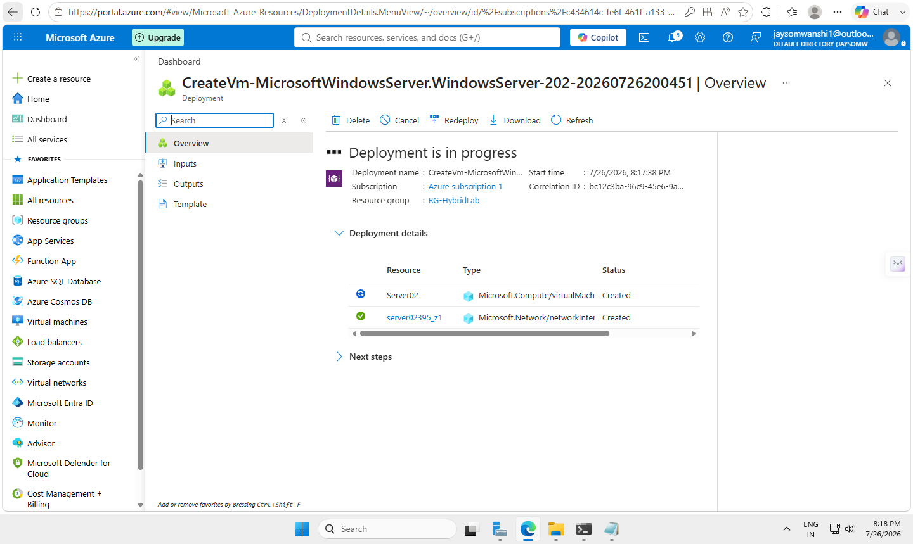
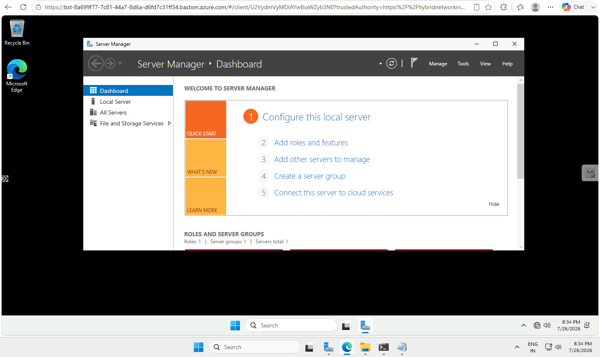

# 🚀 Lab 06 - Deploy Windows Server Virtual Machine in Azure

## 📌 Objective

Deploy a Windows Server Virtual Machine inside an Azure Virtual Network and securely access it using Azure Bastion.

This lab demonstrates how Azure administrators deploy servers in a secure cloud environment without exposing virtual machines directly to the internet.

---

# 🏗️ Lab Architecture

Azure Subscription

    |
    |

Resource Group

RG-HybridLab

    |
    |

Virtual Network

vnet-hq-001
192.168.10.0/24

    |
    |

Servers Subnet

192.168.10.0/26

    |
    |

Network Security Group

NSG-Servers

    |
    |

Windows Server VM

Server02

Private IP:
192.168.10.5

    |
    |

Azure Bastion Secure Access

---

# 🛠️ Implementation Steps

## 1. Created Azure Virtual Machine

Created a Windows Server virtual machine with the following configuration:

| Setting | Value |
|---|---|
| Virtual Machine Name | Server02 |
| Operating System | Windows Server 2022 Datacenter |
| Virtual Network | vnet-hq-001 |
| Subnet | Servers |
| Private IP | 192.168.10.5 |
| Public IP | None |
| Security | NSG-Servers |

---

# 2. Network Configuration

The VM was deployed inside the existing Azure network.

## Virtual Network

vnet-hq-001

192.168.10.0/24

## Subnet

Servers

192.168.10.0/26

Azure automatically assigned a private IP address:

Server02

192.168.10.5

---

# 3. Network Security Group Configuration

The existing subnet-level NSG was used:

NSG-Servers

Configured rules:

| Priority | Rule | Port | Action |
|---|---|---|---|
| 100 | Allow-RDP | TCP 3389 | Allow |
| 110 | Allow-http | TCP 80 | Allow |
| 120 | Allow-https | TCP 443 | Allow |
| 65000 | AllowVnetInBound | Any | Allow |
| 65500 | DenyAllInbound | Any | Deny |

The NSG works as a cloud firewall to control network traffic.

---

# 4. Secure VM Access Using Azure Bastion

The VM was deployed without a public IP address.

Connection flow:

Administrator Laptop

    |
    |

Azure Portal

    |
    |

Azure Bastion

    |
    |

Server02

Private IP:
192.168.10.5

Benefits:

✅ No direct public RDP exposure  
✅ Secure browser-based administration  
✅ Private VM connectivity  
✅ Reduced attack surface  

---

# 📸 Screenshots

## Azure Dashboard

---

## Virtual Machine Creation

---

## VM Basic Configuration

---

## VM Networking Configuration

---

## Validation and Deployment

---

## Azure Bastion Connection

---

# 🎯 Skills Demonstrated

Through this lab, I practiced:

- Azure Virtual Machine Deployment
- Windows Server Deployment
- Virtual Network Integration
- Subnet Assignment
- Private IP Addressing
- Network Security Group Configuration
- Azure Bastion Secure Access
- Cloud Infrastructure Administration

---

# 🔜 Next Lab

## Lab 07 - Active Directory Domain Controller Deployment

Planned activities:

- Install Active Directory Domain Services
- Configure DNS Server
- Create Domain Controller
- Create Users and Organizational Units
- Join Client Machines to Domain

---

# 👨‍💻 Author

**Jay Somwanshi**

System Administrator | Azure Infrastructure Learner

GitHub:
https://github.com/jaysomwanswanshi
