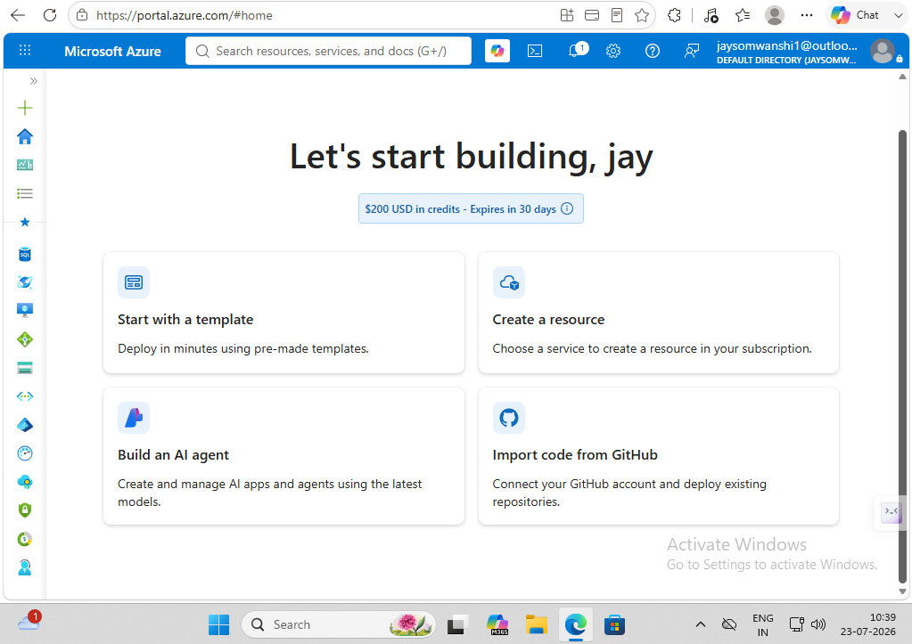
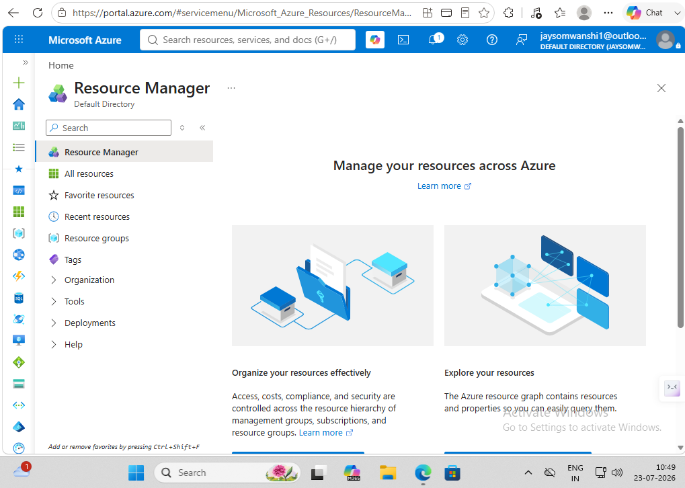
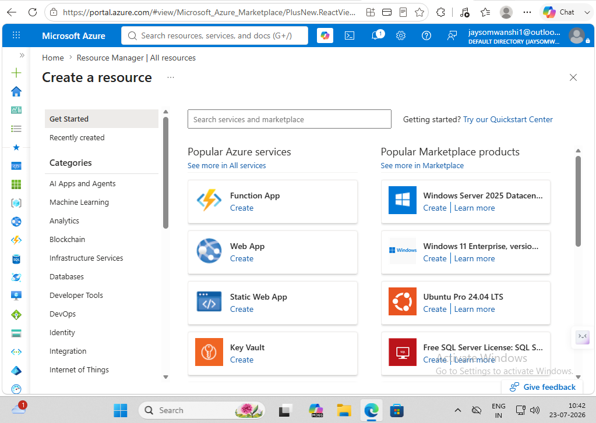
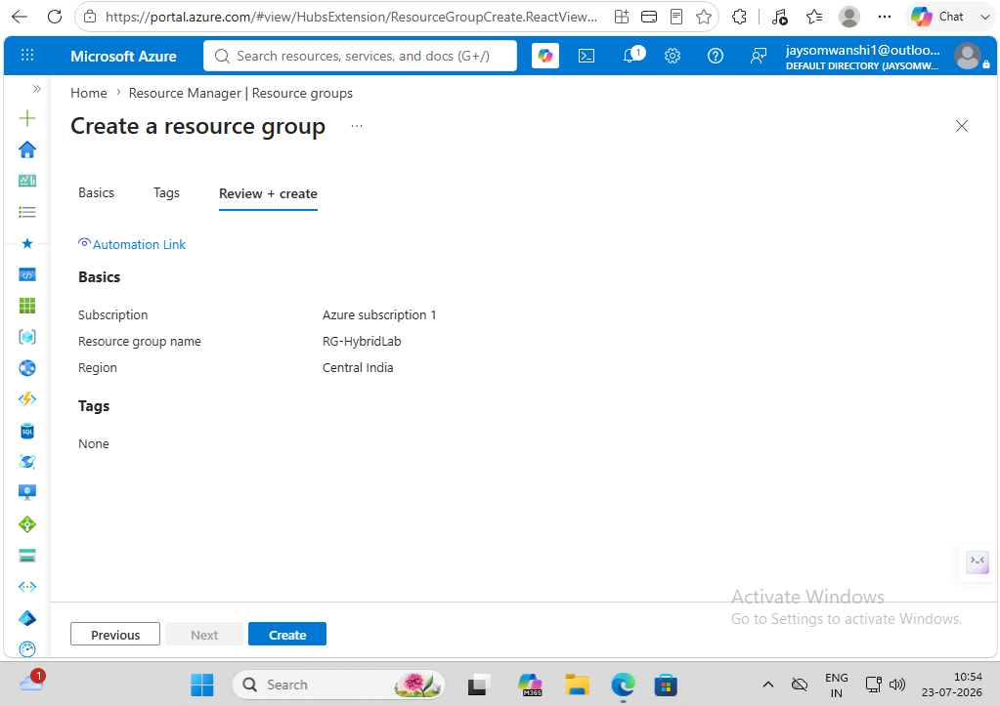
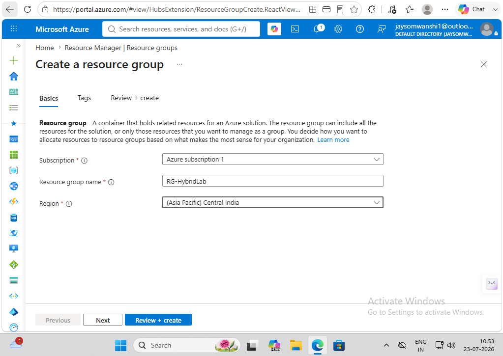
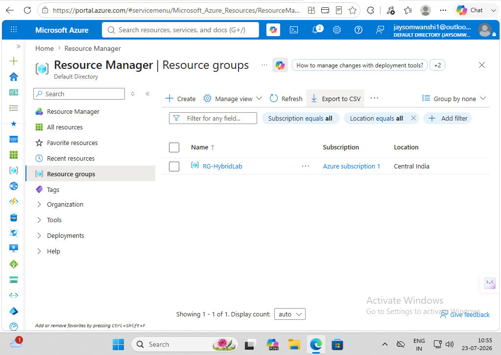

# Lab 01 - Azure Resource Group

## Objective

Create an Azure Resource Group to organize resources for the Azure Hybrid Infrastructure Lab.

---

## Azure Portal Dashboard

---

## Resource Groups

---

## Create Resource Group

---

## Resource Group Configuration

---

## Review + Create

---

## Deployment Completed

